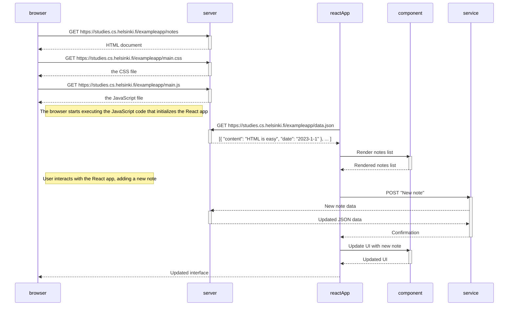

Exercise 0.6:

```mermaid
sequenceDiagram
  participant browser
  participant server
  participant reactApp
  participant component
  participant service

  browser->>server: GET https://studies.cs.helsinki.fi/exampleapp/notes
  activate server
  server-->>browser: HTML document
  deactivate server

  browser->>server: GET https://studies.cs.helsinki.fi/exampleapp/main.css
  activate server
  server-->>browser: the CSS file
  deactivate server

  browser->>server: GET https://studies.cs.helsinki.fi/exampleapp/main.js
  activate server
  server-->>browser: the JavaScript file
  deactivate server

  Note right of browser: The browser starts executing the JavaScript code that initializes the React app

  reactApp->>server: GET https://studies.cs.helsinki.fi/exampleapp/data.json
  activate server
  server-->>reactApp: [{ "content": "HTML is easy", "date": "2023-1-1" }, ... ]
  deactivate server

  reactApp->>component: Render notes list
  activate component
  component-->>reactApp: Rendered notes list
  deactivate component

  Note right of browser: User interacts with the React app, adding a new note

  reactApp->>service: POST "New note"
  activate service
  service-->>server: New note data
  activate server
  server-->>service: Updated JSON data
  deactivate server
  service-->>reactApp: Confirmation
  deactivate service

  reactApp->>component: Update UI with new note
  activate component
  component-->>reactApp: Updated UI
  deactivate component

  reactApp-->>browser: Updated interface


```